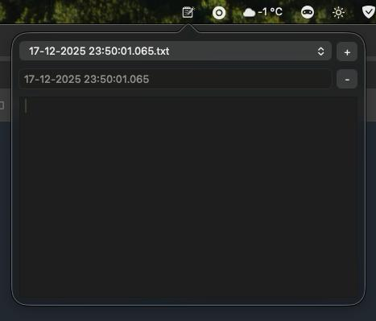
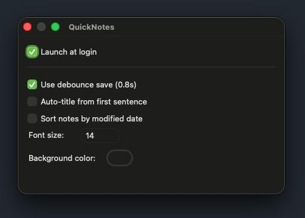

QuickNotes - macOS menu bar notes

Minimal native macOS menu-bar app for quick notes. Left-click the status icon to open a popover with a notes dropdown, a plus button to create a new note, and an editor with autosave debounce. Right-click for a context menu (Open window / Close app).

Build & run

- Build: `make`
- Run: `make run`

Behavior

- Notes are stored as separate `.txt` files under `QuickNotesData/QuickNotesContent` next to the binary (or next to the `.app` bundle); names use a human-readable timestamp unless auto-titles are enabled.
- Logs (errors only) are written to `QuickNotesData/Logs/quicknotes.log` next to the binary (or next to the `.app` bundle).
- Icons: drop `icon.png` into `QuickNotesData/Assets/` (preferred) or next to the binary; Makefile copies the root `icon.png` into `build/` for convenience. If no icon is found, a simple pencil icon is drawn in code. The same image is used for the app icon.
- Settings window (right-click → Settings): toggle debounce saving, auto-title from first sentence, font size, background color.
- Settings persist to `QuickNotesData/Settings/settings.json` next to the binary (or next to the `.app` bundle).
- Icons: 
	- Tray / status bar: `QuickNotesData/Assets/tray-icon.png` (fallback `icon.png` in the same folder or next to the binary).
	- App icon (Dock/Finder, bundle): `QuickNotesData/Assets/app-icon.png` (fallback `QuickNotesData/Assets/icon.png` or the tray icon). Makefile also accepts root-level `app-icon.png`/`tray-icon.png` when building.
- Bundle build: `make bundle` produces `build/QuickNotes.app`; when run, it will read/write `QuickNotesData` located next to the `.app` (not inside it).
- Sorting: dropdown follows Settings — creation date (default) or modification date.
- On first launch (no notes), an empty note file is created so the dropdown has a selection.
- Closing the optional "Open" window hides the Dock icon; "Close" fully quits the app.

Tech

- Swift + AppKit, built with `swiftc` via Makefile; no extra dependencies.

Screenshots

License

- [MIT](LICENSE)

Have fun!